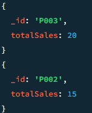

# MongoDB
FSD_ExperimentNo_12

# MongoDB Aggregation and Logical Operations

## Project Aim
To implement and demonstrate MongoDB aggregation pipeline commands combined with logical query operators for effective data querying and analysis.

---

## Setup

### Create Database and Collection

use salesDB;
db.createCollection("orders");

---

## Insert Sample Data

---

---

## Aggregation Query with Logical Operators

This aggregation pipeline:

- Filters orders where `status` is `"completed"` **AND** either `qty` is greater than or equal to 10 **OR** `price` is greater than or equal to 100.
- Groups the documents by `productId`.
- Calculates total quantity sold (sum of `qty`) per product.
- Sorts the results by the total sales in descending order.

---

---

## Additional Logical Queries

- Find orders with status `"completed"` and quantity less than 15:

---

---

- Find orders where status is **not** `"completed"`:

---

---

- Find orders where quantity is **not** greater than 10:

---

---

## Projection Example in Aggregation

Show only specific fields in results:

---

---

## Adding Computed Fields

Add a calculated `totalPrice` field in aggregation:

---

---